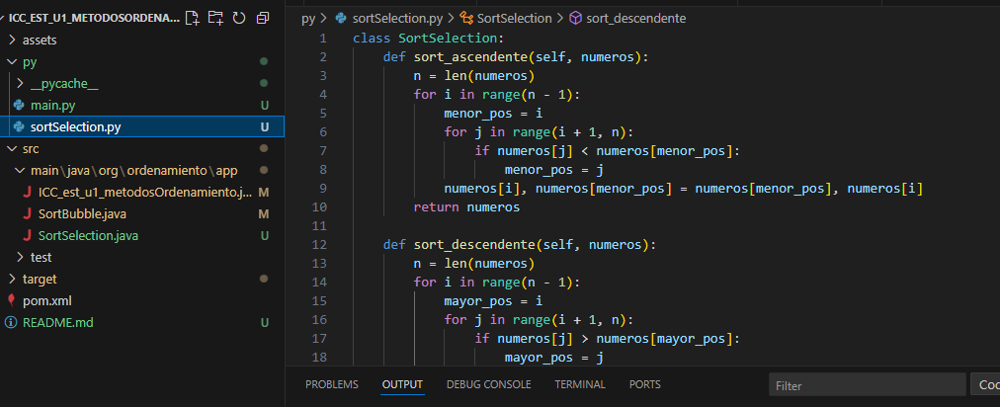
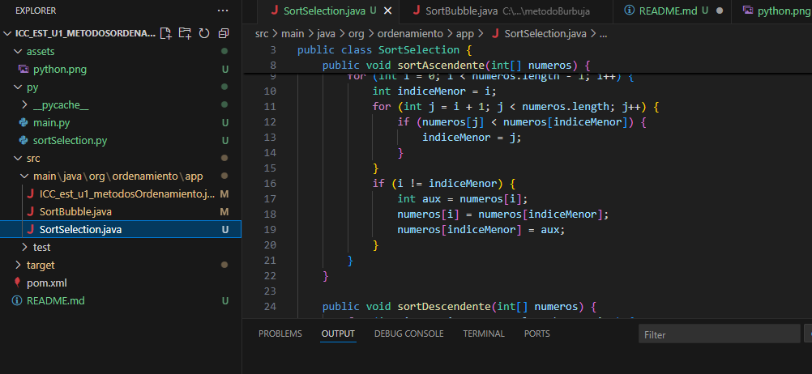
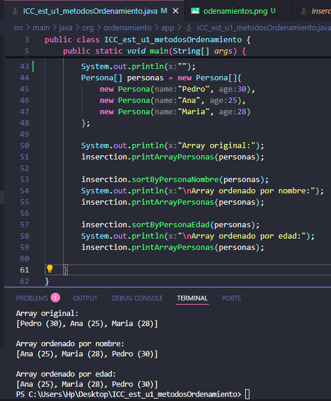
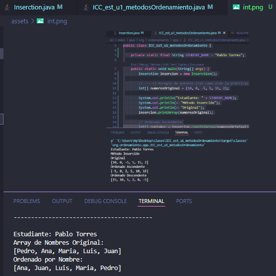
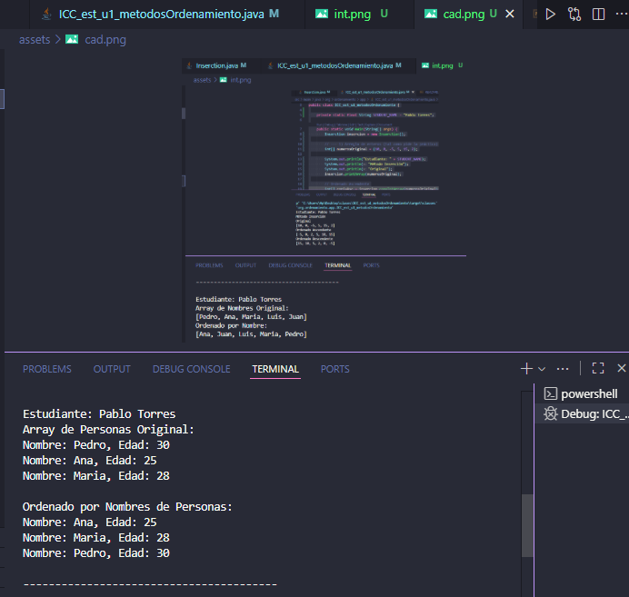
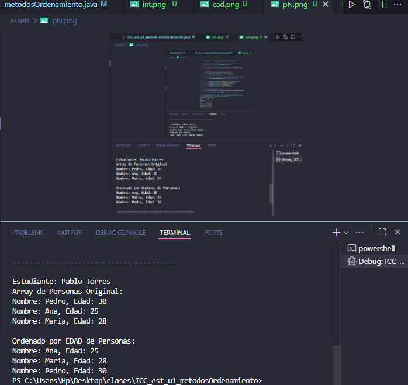

# Estructura de datos

**Estudiante:**  Joshue Avecillas

## Métodos de Ordenamiento

### Práctica 1 - 20/oct
**Método:** Sort Bubble

---

### Práctica 2 - 21/oct
**Método:** Sort Selección en Java y Python

#### Salida de Python

#### Salida de Java

---

### Práctica 3 - 23/oct
**Ordenamiento de números**

**Ordenamiento de personas**

---

### Práctica 4 - 10/nov
**Método:** Ordenamiento por Inserción

#### Arreglo de enteros

#### Arreglo de cadenas

#### Arreglo de personas (por nombre)

#### Arreglo de personas (por edad)

